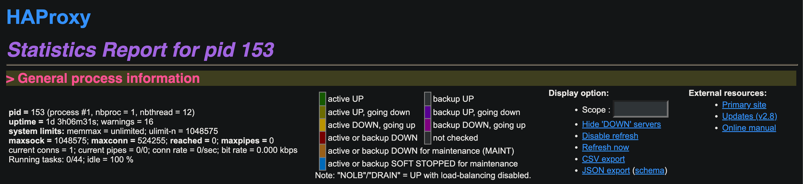

The `easy-lb-proxy` was a nice open source given by [Miguel Grinberg](https://blog.miguelgrinberg.com/post/about-me) to provide a simple way to deploy `haproxy`, `confd` using Docker. It was also used in the `micro_flack` demo presented by Miguel at PyCon 2017 on May 17th, 2017. However, it is 6 years since last commit was pushed to the [source-code repository](https://github.com/miguelgrinberg/easy-lb-haproxy). Thus, some modifications are required if we want to apply the source-code with modern hardwares (e.g. ARM architecture) and softwares (latest `haproxy` and confd). This post will discuss how to develop a Docker image installing latest `haproxy` and `confd` versions with ability run with new MacBook (M1/M2 CPUs).

<!-- truncate -->

## What `easy-lb-haproxy` is?

> Accoriding the the `easy-lb-haproxy` README, it is a repository that defines a load balancer container for Docker, based on `haproxy`, `confd` and `etcd`.

The `haproxy` load balancer will be gracefully reload when its configuration is changes by `confd`, which pulls configuration data from a `ectd` node/cluster.

In `easy-lb-haproxy` repository, `haproxy` is the version 1.7 (for alpine) while `confd` is binary file for running on `amd64/alpine` environment as shown in the Dockerfile below:

```Dockerfile
FROM haproxy:1.7-alpine
RUN apk add --update curl && rm -rf /var/cache/apk/*
RUN mkdir -p /etc/confd/conf.d
RUN mkdir -p /etc/confd/templates
COPY confd .
RUN chmod +x confd
COPY haproxy.toml /etc/confd/conf.d/
COPY haproxy.tmpl /etc/confd/templates/
COPY boot.sh .
COPY watcher.sh .
EXPOSE 80
CMD ["./boot.sh"]
```

## Why `easy-lb-haproxy` Need Being Revisited?

At the time writing this post, when running the image of `easy-lb-haproxy` (miguelgrinberg/easy-lb-haproxy) on Macbook M1, we will got this warning:

```bash
(base) ~ % docker run -d miguelgrinberg/easy-etcd

Unable to find image 'miguelgrinberg/easy-etcd:latest' locally
latest: Pulling from miguelgrinberg/easy-etcd
627beaf3eaaf: Already exists
9407f1b3f535: Pull complete
f45e820e1b24: Pull complete
1da0226fd80a: Pull complete
e71e952e8745: Pull complete
da4180eebdd1: Pull complete
Digest: sha256:b46545c321667c591f78e6f91b4c856c25350cb27e51c5f6304e43a6e9881416
Status: Downloaded newer image for miguelgrinberg/easy-etcd:latest
WARNING: The requested image's platform (linux/amd64) does not match the
detected host platform (linux/arm64/v8) and no specific platform was requested
```

When logging out the docker container, we will see this error:

```bash
(base) ~ % docker ps
CONTAINER ID   IMAGE                            COMMAND
3241869758a2   miguelgrinberg/easy-lb-haproxy   "/docker-entrypoint.…"
(base) ~ % docker logs 3241869758a2
runtime: failed to create new OS thread (have 2 already; errno=22)
fatal error: runtime.newosproc
```

This problem can also be faced when running the image on other ARM hardware, e.g. Raspberry Pi. It needs to make some modifications to make it run on these hardwares.

## How to Modify `easy-lb-haproxy` Docker Image?

In order to modify `easy-lb-haproxy` to run on new hardwares and softwares, we need to: 1. change base Docker Image, 2. rebuild `confd` , and 3. rebuild `easy-lb-haproxy`.

### Step 1: Use New Docker Image

Since the original `easy-lb-haproxy` used base image of `haproxy:1.7-alpine`, we will choose to use the newest official haproxy docker images on `alpine`, which is `haproxy:alpine3.18` . We also need another docker image with `golang` installed to build confd, so we choose the official golang image with the same `alpine3.18` , which is `1.20.10-alpine3.18`.

### Step 2: Rebuild `confd`

You can follow the instruction at https://github.com/kelseyhightower/confd for building `confd` from source code. To build it with `alpine` docker, just run:

```bash
(base) ~ % docker run -it golang:1.20.10-alpine3.18 sh
/go # apk update && apk add git make
/go # mkdir -p $GOPATH/src/github.com/kelseyhightower
/go # git clone https://github.com/kelseyhightower/confd.git \
$GOPATH/src/github.com/kelseyhightower/confd
/go # cd $GOPATH/src/github.com/kelseyhightower/confd
/go/src/github.com/kelseyhightower/confd # make
/go/src/github.com/kelseyhightower/confd # ls bin
confd
```

### Step 3: Rebuild easy-lb-proxy

We will follow the [Dockerfile](https://github.com/anhttra/revisiting-easy-lb-haproxy/blob/master/Dockerfile) in the repo to build our new `easy-lb-proxy` image, except that we will use the base image in the step 1 and the latest `confd` obtained in step 2. The new Dockerfile will be:

```Dockerfile
FROM golang:1.20.10-alpine3.18 as build
RUN apk add --update git make
RUN mkdir -p $GOPATH/src/github.com/kelseyhightower && \
    git clone https://github.com/kelseyhightower/confd.git \
    $GOPATH/src/github.com/kelseyhightower/confd && \
    cd $GOPATH/src/github.com/kelseyhightower/confd && \
    make

FROM haproxy:alpine3.18
USER root
RUN apk update && apk add curl && rm -rf /var/cache/apk/*
RUN mkdir -p /etc/confd/conf.d
RUN mkdir -p /etc/confd/templates
COPY --from=build /go/src/github.com/kelseyhightower/confd/bin/confd .
RUN chmod +x confd
COPY haproxy.toml /etc/confd/conf.d/
COPY haproxy.tmpl /etc/confd/templates/
COPY boot.sh .
COPY watcher.sh .
EXPOSE 80
CMD ["./boot.sh"]
```

Then we can run the new Docker image without the error as `runtime: failed to create new OS thread (have 2 already; errno=22)`.

```bash
(base) % docker build -t revisit-easy-lb-haproxy .
(base) % docker run -it revisit-easy-lb-haproxy
2023-10-13T13:42:04Z b491152c349a ./confd[9]: INFO Backend set to etcd
2023-10-13T13:42:04Z b491152c349a ./confd[9]: INFO Starting confd
```

## Conclusion & Future Works

In this post, we show how to modify the `easy-lb-haproxy` source code to achieve the new Docker image, which is able to run on new hardware with new softwares. However, the current confd template files (`haproxy.tmpl` and `haproxy.toml`) do not work correctly by some reasons (API updates of `etcd`, changes of `confd` template syntax, and changes in the way `haproxy` is reload). We will cover the fix for these issues in the next post.
