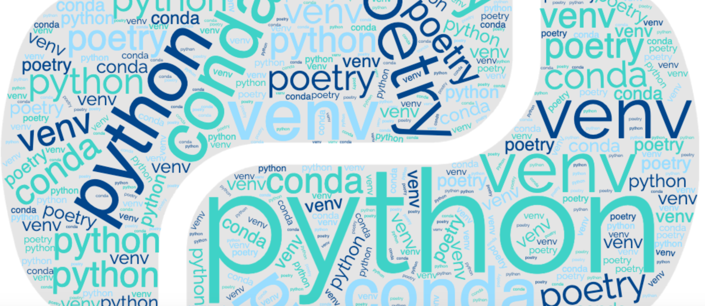

`Poetry` is being used more and more in Python project as a very convenient tool for managing dependencies. Since conda is a great tool for handling virtual environment, the combination between `conda` and `poetry` help Python projects well-organized and perfectly isolated.

<!-- truncate -->

## Project Initialization Using `conda` and `poetry`

Install `conda/miniconda`

- https://conda.io/projects/conda/en/latest/user-guide/install/macos.html

Create a new `conda` environment

```bash
conda create -n <name-of-env>
conda activate <name-of-env>
(name-of-env) conda install python=<python-version>
```

Install `poetry`

```bash
(name-of-env) pip install poetry
```

or using `conda`

```bash
(name-of-env) conda install poetry
```

Initialize project

```bash
(name-of-env) mkdir <project-name>
(name-of-env) cd <project-name>
(name-of-env) poetry init
```

**Note:** If you got this error `ModuleNotFoundError: No module named 'chardet'`, you should install the `charset` library as below before reinitializing your project. This error may happen when installing `poetry` using `conda`.

```bash
conda install -c conda-forge charset-normalizer
```

## Other Tips with `conda`

- Install node in conda:

```bash
 conda install -c conda-forge nodejs
```

- Autocompletion in zsh: https://github.com/conda-incubator/conda-zsh-completion

## References

- https://medium.com/@silvinohenriqueteixeiramalta/conda-and-poetry-a-harmonious-fusion-8116895b6380
- https://michhar.github.io/2023-07-poetry-with-conda/
